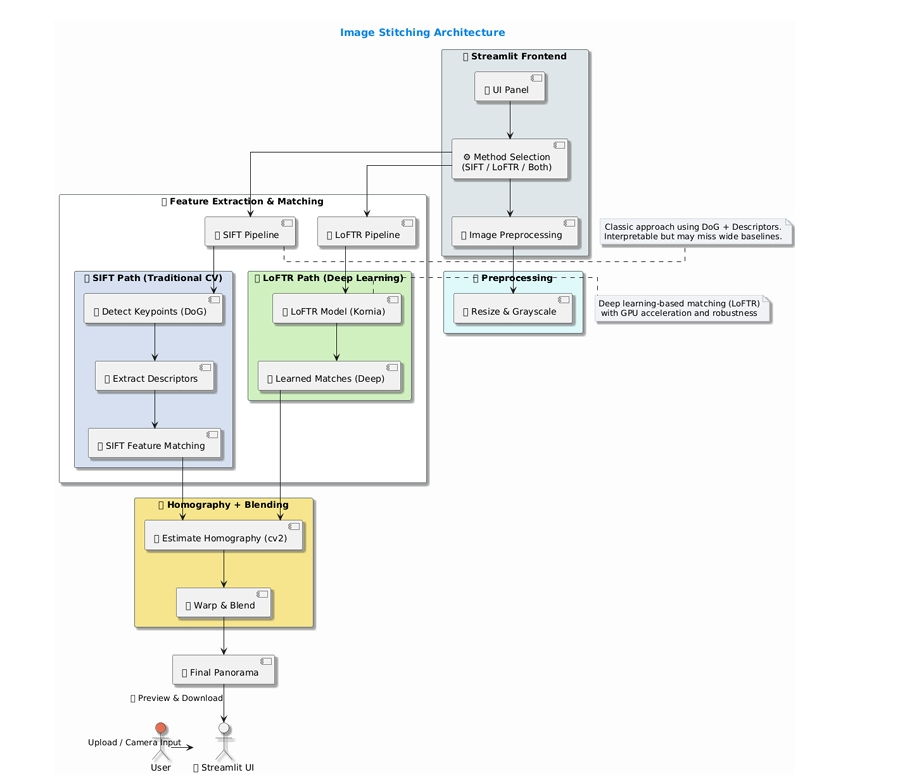

# 🌌 Image Stitching Hub

**Image Stitching Hub** is an interactive web-based tool designed to seamlessly stitch two overlapping images. It supports two feature detection methods: the traditional computer vision **SIFT** pipeline and the deep learning-based **LoFTR** approach. Built with **Streamlit**, the project provides a full end-to-end pipeline—from feature detection and matching to homography estimation and panorama generation—with an intuitive and responsive UI.


---

## 🚀 Features

- **LoFTR-based Deep Feature Matching**: Utilizes Kornia and PyTorch for advanced, transformer-based matching.
- **SIFT-based Classic Keypoint Detection**: Implements the traditional scale-space, keypoint detection, and matching methods.
- **Flexible Execution**: Choose between SIFT, LoFTR, or run both methods simultaneously.
- **User-Friendly UI**: Crafted with Streamlit and enhanced by custom HTML/CSS for a clean and responsive experience.
- **Live Preview**: Instantly view the generated panorama from the stitched images.

---

## 📁 Project Structure

```text
Image-Stitching-Hub/
├── app.py                      # Main Streamlit application
├── lib/
│   ├── sift_functions.py       # Functions for the SIFT pipeline
│   ├── helper_functions.py     # Utility functions (e.g., resizing, color conversion)
│   └── image_stitcher.py       # Image matching, descriptors, and warping functions
├── requirements.txt            # Python dependencies and requirements
└── README.md                   # Project documentation and guidelines
```

---

## 🔧 Technologies Used

- **OpenCV** — Powerful image processing library for keypoint detection, matching, and homography estimation.
- **Streamlit** — Rapid web app framework for building interactive UIs.
- **Kornia** — Deep learning computer vision library used with the LoFTR model.
- **PyTorch** — Deep learning framework serving as the backbone for the LoFTR model.
- **NumPy** & **PIL** — Essential tools for array operations and image processing.

---

## 📸 How It Works

### 🔬 SIFT Pipeline

1. **Gaussian Pyramid & DoG Generation**: Constructs scale-space representations.
2. **Scale-space Extrema Detection**: Identifies potential keypoints.
3. **Sub-pixel Localization & Orientation Assignment**: Improves keypoint accuracy.
4. **Descriptor Extraction**: Creates feature descriptors for keypoints.
5. **Brute-Force Matching**: Matches descriptors between two images.
6. **Homography Estimation and Stitching**: Aligns images to generate a panorama.

### 🤖 LoFTR Pipeline

1. **Preprocessing**: Converts images to grayscale.
2. **Feature Matching**: Uses the transformer-based LoFTR model (with pretrained ‘outdoor’ configuration) for matching.
3. **RANSAC-based Homography Estimation**: Robustly calculates the transformation between images.
4. **Image Warping and Blending**: Stitches the images together to form a seamless panorama.

---

## 🧑‍💻 How to Run Locally

1. **Clone the repository:**
   ```bash
   git clone https://github.com/your-username/Image-Stitching-Hub.git
   cd Image-Stitching-Hub
   ```

2. **Install dependencies:**
   ```bash
   pip install -r requirements.txt
   ```

3. **Run the Streamlit app:**
   ```bash
   streamlit run app.py
   ```

> **Note:** Ensure you have Python 3.8+ installed. For LoFTR, a CUDA-compatible GPU is recommended for improved performance.

---

## 👥 Team Contributions

| Member              | Responsibilities                                                                       |
|---------------------|----------------------------------------------------------------------------------------|
| **Subhash Mishra**  | RANSAC Algorithm, Homography estimation, stitching logic |         |
| **Avaneesh Pandey** | Implementation of Gaussian Pyramid, keypoint detection, SIFT matching, and LoFtr |
| **Nikhil Kumar**    | Orientation assignment, descriptor extraction, panorama warping, and parameter tuning  |
| **Jatin**           | Streamlit UI/UX, architecture design, and frontend styling, stitching logic,  DoG generation |

---

## 🧱 Architecture Diagram




## 📜 License

This project is open-source and available under the [MIT License](LICENSE).

---

## 🙌 Acknowledgements

- [Kornia](https://github.com/kornia/kornia) for their excellent computer vision libraries and the LoFTR model.
- [OpenCV](https://opencv.org/) for providing comprehensive image processing functionalities.
- [Streamlit](https://streamlit.io/) for enabling rapid development of interactive web applications.

---

Happy Image Stitching!
